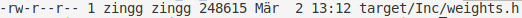
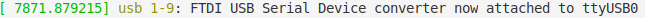
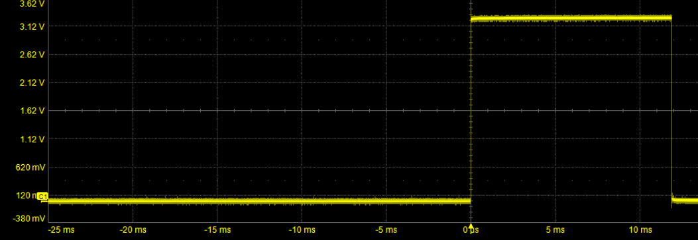

## Workflow with X-CUBE-AI
 
### Convert Neural Network into Source Code
 - Start STM32CubeMX
 - In the section `File` chose the option to `Load Project` and select the file: `cnn.ioc` for a cnn **OR**
 - In the section `File` chose the option to `Load Project` and select the file: `dense.ioc` for a single layer dense
- **CAUTION: Adapt the input path of the neural network in the section `Additional Software`**
- **CAUTION: Adapt the output path of the generated code in the section `Project Manager`**

Press `GENERATE CODE`

### Build and Flash Firmware
Switch into the gen directory and checkout the wrong changed files:
```bash
$ cd gen
$ git checkout ../Src/main.c ../Src/app_x-cube-ai.c ../Inc/app_x-cube-ai.h Makefile
```
Build the file and flash it to the target
```bash
$ make
$ ../../tools/stlink/build/Release/st-flash --format ihex write ./build/ST.hex
```

### Evaluate the CUBE-AI Neural Network on the STM32F429

#### Memory
To analyse the memory footprint of the firmware you can use:
```bash
$ arm-none-eabi-size build/ST.elf
```
The output should look like this:


To analyse the momory required for the neural network you can look at the filesize of:
`/Src/network.c` with:
```bash
$ ll ../Src/network.c 
```
The output should look like this:



#### Accuracy
Connect the serial device hardware to your serial device
```
PA0-WKUP STM32F429-Board ------> TX Host serial device 
PA1      STM32f429-Board ------> RX Host derial device
GND      STM32f429-Board ------> GND Host
```
Get the name of your serial connection:
```
$ dmesg
```
The output should look like this:



The last part of the message, here ttyUSB0, is the name of your serial device.

Switch into the tool directory and run the evaluation script.
**!CAUTION: Adjust the parameter `/dev/ttyUSB0`!**
```bash
$ cd ../../tools/
$ python3 eval.py /dev/ttyUSB0 100
```
The command above:
`python3 eval.py /dev/ttyUSB0 100`
sends `100` test images to the STM32F429 and evaluates the predictions from the board.
Maximum of `10000` images can be evaluated.

#### Runtime
To measure the inference runtime of the neural net connect the GPIO `PIN0` of `GPIOB` to an oscilloscope
The output of your scope should look like this:


