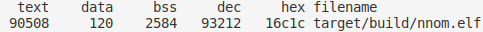
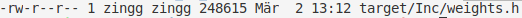
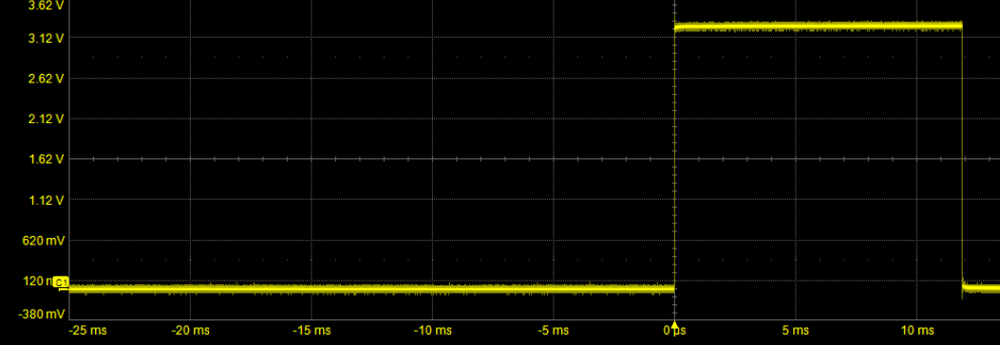

## Workflow with [NNoM](https://github.com/majianjia/nnom)
The nnom framework is created by Jianjia Ma. Documentation and source code is available on [github](https://github.com/majianjia/nnom)

### Convert Neural Network into Source Code
Generate the weights for the dense model with:
```bash
$ python3 generateDense.py
```
**or** the weights for the cnn model with:
```bash
$ python3 generateCnn.py
```
### Build and Flash Firmware
Switch into the target directory, build the firmware with the converted neural network:
```bash
$ cd target
$ make
```
Flash the firmware to the device:
```bash
$ ../../tools/stlink/build/Release/st-flash --format ihex write ./build/nnom.hex
```
### Evaluate the NNOM Neural Network on the STM32F429

#### Memory
To analyse the memory footprint of the firmware you can use:
```bash
$ arm-none-eabi-size target/build/nnom.elf 
```
The output should look like this:



To analyse the momory required for the neural network you can look at the filesize of:
`target/Inc/weights.h` with:
```bash
$ ll target/Inc/weights.h 
```
The output should look like this:



#### Accuracy
Connect the serial device hardware to your serial device
```
PA0-WKUP STM32F429-Board ------> TX Host serial device 
PA1      STM32f429-Board ------> RX Host derial device
GND      STM32f429-Board ------> GND Host
```
Get the name of your serial connection:
```
$ dmesg
```
The output should look like this:


The last part of the message, here ttyUSB0, is the name of your serial device.

Switch into the tool directory and run the evaluation script.
**!CAUTION: Adjust the parameter `/dev/ttyUSB0`!**
```bash
$ cd ../../tools/
$ python3 eval.py /dev/ttyUSB0 100
```
The command above:
`python3 eval.py /dev/ttyUSB0 100`
sends `100` test images to the STM32F429 and evaluates the predictions from the board.
Maximum of `10000` images can be evaluated.

#### Runtime
To measure the inference runtime of the neural net connect the GPIO `PIN0` of `GPIOB` to an oscilloscope
The output of your scope should look like this:


